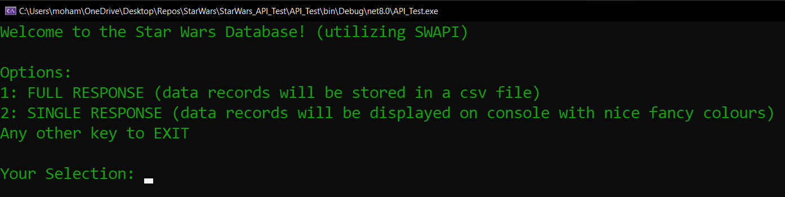
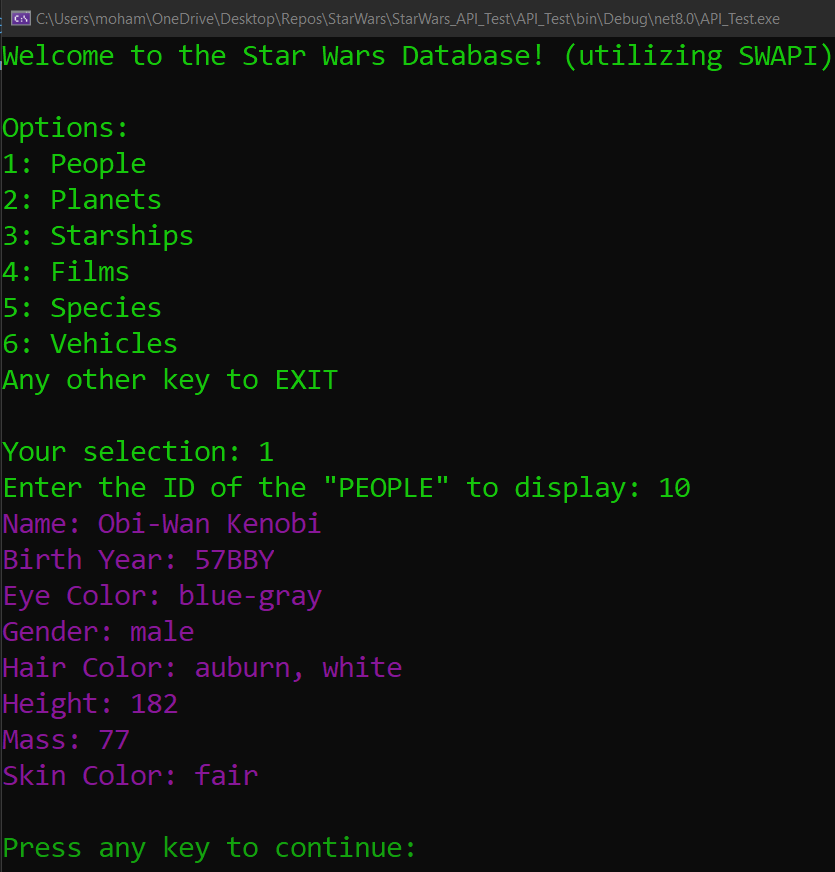
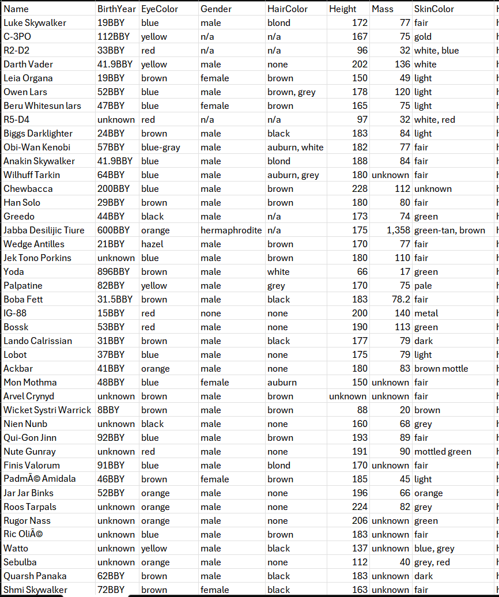

# Star Wars Data Retriever
This project is a C# console application that:
  1. Retrieves information from a Star Wars database using an API
  2. Maps the data to corresponding C# classes
  3. Saves the retrieved data into CSV files for offline access

## Introduction
Welcome to the Star Wars Data Retriever project!
This C# application leverages the Star Wars API [SWAPI](https://swapi.dev/) to fetch comprehensive information about the Star Wars universe.
The application maps this data into structured C# classes and exports it into user-friendly CSV files, making it easy to explore and analyze the vast Star Wars dataset.
Users are also able to view individual records on the console.

## Features
### 1. API:
  - Retrieve data from all available SWAPI endpoints
  - Supports all key Star Wars data points, including:
    - People,
    - Films,
    - Planets,
    - Species,
    - Starships and
    - Vehicles

### 2. Model Mapping:
  - Full response from endpoint -> data model -> store in CSV file
  - Single response from endpoint -> data model -> colourful display on console

### 3. CSV Mapping:
  -  Combining records from each endpoint
  -  Using a ClassMap to flatten the IEnumerables inside each data model into a single joined string
  -  Writing each record into its respective file

## Dependencies Used
The following packages are installed from the NuGet Package Manager:
  - CsvHelper
  - Newtonsoft.Json

## Usage
- The application will:
  - Connect to the SWAPI -> User will be able to select between Full and Single responses
  - Retrieve data from various endpoints
  - Map the data to C# objects
  - Save the results as CSV files in the *CSV_Files* directory, OR
  - View data on the console

## Images from console

### Main Menu

### Display Single Response From People Endpoint

### Full Response CSV From People Endpoint

